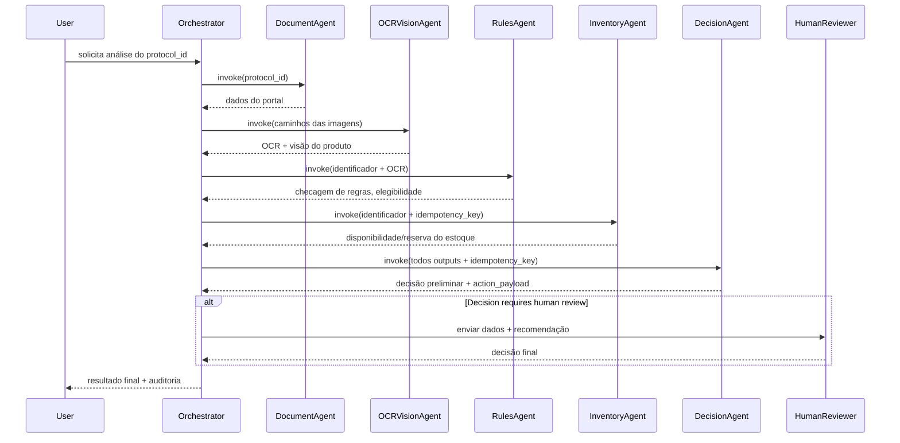
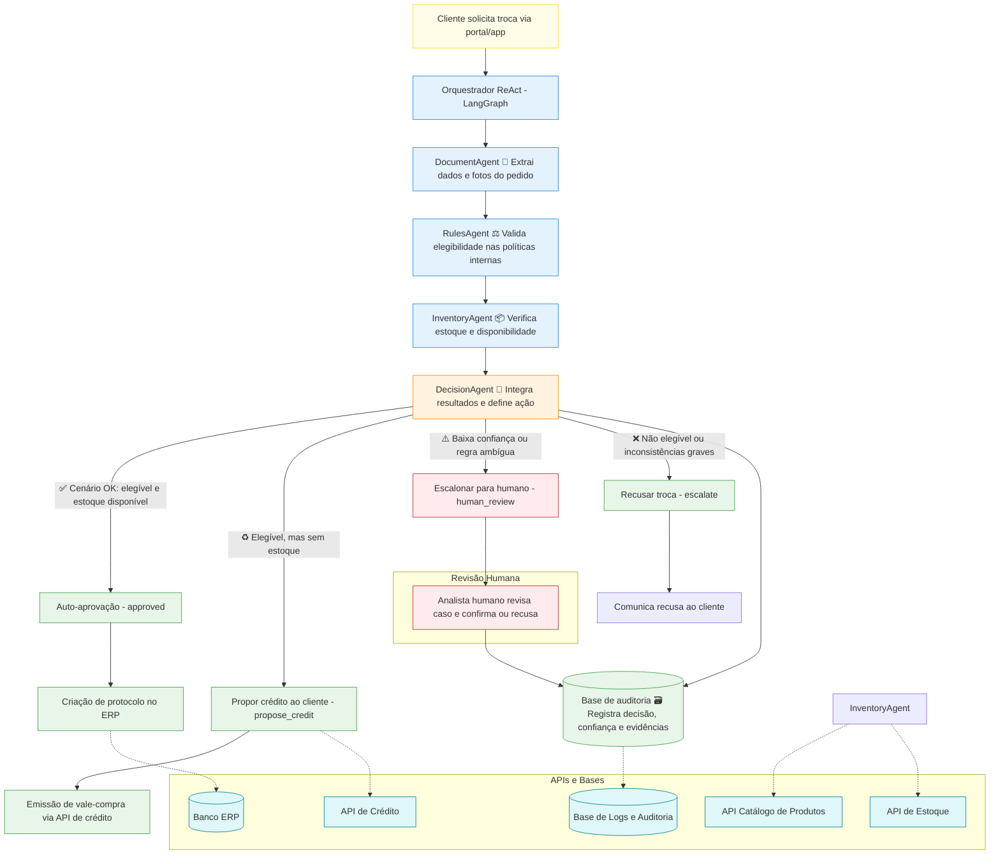
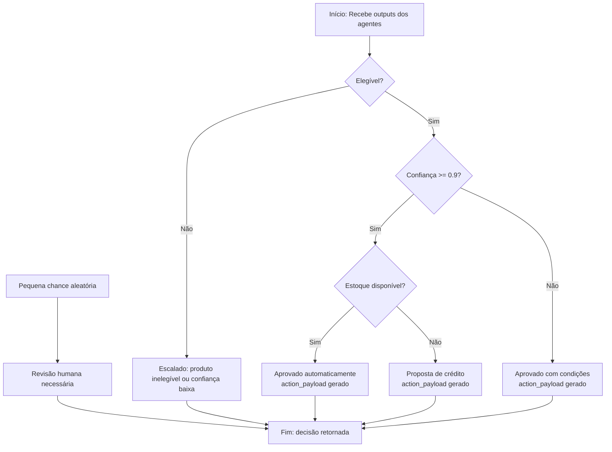

# 🤖 Orquestrador de Agentes AI

Este projeto implementa um **orquestrador de agentes inteligentes** que integra diversos módulos para análise e decisão automática de solicitações de troca/exchange, utilizando:

- **LLMs** (Large Language Models)  
- **OCR e visão computacional**  
- **Regras de negócio**  
- **Mock de agentes** para testes offline

O fluxo principal envolve os seguintes agentes:

| Agente | Função |
|--------|--------|
| **DocumentAgent** | Analisa dados do pedido e do portal. |
| **OCRVisionAgent** | Processa imagens de invoice e produto para extrair informações e classificar danos. |
| **RulesAgent** | Aplica regras de negócio por Item do pedido. |
| **InventoryAgent** | Verifica disponibilidade de estoque e realiza reservas. |
| **DecisionAgent** | Consolida saídas dos agentes e aplica políticas de decisão (aprovação automática, proposta de crédito, escalonamento ou revisão humana). |

---

## ⚙️ Pré-requisitos

- Python >= 3.10  
- pip  
- Virtualenv (recomendado)

---

## 🛠️ Instalação

1. **Clone o repositório:**

```bash
git clone <URL_DO_REPOSITORIO>
cd <PASTA_DO_PROJETO>
```

2. **Crie um ambiente virtual (opcional, mas recomendado):**

```bash
python -m venv venv
```

3. **Ative o ambiente virtual:**

- **Linux / macOS:**
```bash
source venv/bin/activate
```
- **Windows:**
```bash
venv\Scripts\activate
```

4. **Instale as dependências:**

```bash
pip install -r requirements.txt
```

5. **Verifique a instalação:**

```bash
pip list
```

---

## 🚀 Uso

Exemplo de execução do orquestrador com um `protocol_id`:

```python
from app.orchestrator import orchestrate

protocol_id = "PROTO-20251003-0001"
resultado = orchestrate(protocol_id)

print("DECISÃO FINAL:", resultado["decision"])
```

**Fluxo completo:**

1. Fetch de dados do portal (DocumentAgent).  
2. Extração de informações via OCR e visão computacional (OCRVisionAgent).  
3. Aplicação de regras do negócio (RulesAgent).  
4. Checagem e reserva de estoque (InventoryAgent).  
5. Consolidação da decisão e possível ação (DecisionAgent).  
6. Revisão humana caso necessário.  

---

## 📂 Estrutura do Projeto

```
app/
├── agents/             # Agentes de AI (Document, OCR/Vision, Rules, Inventory, Decision)
├── tools/              # Ferramentas de suporte (APIs, OCR, Inventário, Portal)
├── orchestrator.py     # Fluxo principal de orquestração
├── main.py             # Script de execução
requirements.txt        # Dependências do projeto
README.md               # Este arquivo
```

---

## Fluxograma Sequencial



## Fluxograma Completo



## Detalhe do Agente Decisor



-----

## 💡 Notas

- É possível ativar **mocks** para todos os agentes, permitindo testes sem LLM ou APIs externas.  
- As decisões seguem **políticas configuráveis**, incluindo thresholds de confiança e elegibilidade.  
- O projeto suporta **escalonamento e revisão humana** para casos incertos.  

--

